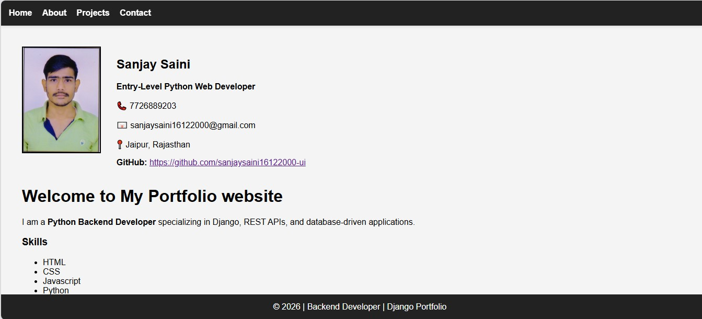
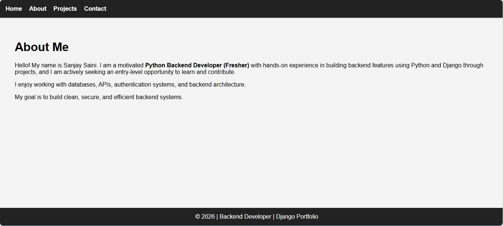

# Django Portfolio Website

A professional, modern portfolio website built with **Django**, showcasing backend development skills, projects, and contact information.

## 🖼️ Screenshots

| Home Page | About Page |
|-----------|------------|
|  |  |

| Projects Page | Contact Page |
|---------------|--------------|
|  |  |

## 🚀 Features

- **Responsive Design**: Mobile-friendly layout with a sticky navigation bar.
- **Dynamic Content**: Pages for Home, About, Projects, and Contact.
- **Contact Form**: Functional contact form that saves messages to the database.
- **Project Showcase**: Displaying various backend projects including REST APIs and authentication systems.
- **Modern UI**: Clean and minimal aesthetics with user-friendly navigation.

## 🛠️ Tech Stack

- **Backend**: Python, Django
- **Frontend**: HTML5, CSS3 (Vanilla CSS), JavaScript
- **Database**: SQLite (default), compatible with PostgreSQL
- **Tools**: Git, GitHub, Virtual Environments

## 📦 Installation & Setup

Follow these steps to run the project locally:

### 1. Clone the repository
```bash
git clone https://github.com/sanjaysaini16122000-ui/My_Portfoliyo_website.git
cd My_Portfoliyo_website
```

### 2. Create and activate a Virtual Environment
```bash
# Windows
python -m venv .venv
.venv\Scripts\activate

# macOS/Linux
python3 -m venv .venv
source .venv/bin/activate
```

### 3. Install dependencies
```bash
pip install django
```

### 4. Run Migrations
```bash
cd portfolio
python manage.py makemigrations
python manage.py migrate
```

### 5. Start the Development Server
```bash
python manage.py runserver
```
Visit `http://127.0.0.1:8000/` in your browser.

## 📂 Project Structure

```text
My_Portfolio_website/
│
├── portfolio/             # Django Project Root
│   ├── myapp/             # Main Application (Views, Models, Templates)
│   ├── portfolio/         # Project Configuration (Settings, URLs)
│   ├── templates/         # HTML Templates
│   ├── static/            # Static files (CSS, Images)
│   │   ├── screenshots/   # Website Page Screenshots
│   │   └── sanjay.jpg     # Profile Image
│   ├── manage.py          # Django Management Script
│   └── db.sqlite3         # Database
│
├── .venv/                 # Virtual Environment
└── README.md              # Project Documentation
```

## 📧 Contact

**Sanjay Saini**  
- **Email**: sanjaysaini16122000@gmail.com  
- **Phone**: 7726889203  
- **Location**: Jaipur, Rajasthan  
- **GitHub**: [github.com/sanjaysaini16122000-ui](https://github.com/sanjaysaini16122000-ui)

---
Developed with ❤️ by Sanjay Saini
